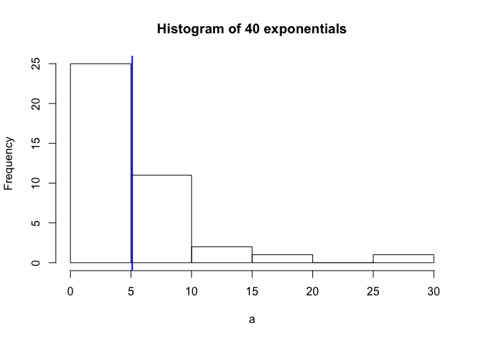

# Statistical Inference: Part 1- Comparing the exponential distribution in R and the Central Limit Theorem 
Lawrence Lau  

This is Part 1 of the course project from the Statistical Inference class in the Data Scientist Specialization course.  The objective is to explore the exponential distribution in R and compare it with the Central Limit Theorem.  

### <font color=blue> Background </font>

From [Wikipedia](http://en.wikipedia.org/wiki/Central_limit_theorem):<br>
The central limit theorem (CLT) states that, given certain conditions, the arithmetic mean of a sufficiently large number of iterates of independent random variables, each with a well-defined expected value and well-defined variance, will be approximately normally distributed, regardless of the underlying distribution.

### <font color=blue> Overview </font>

First, we simulate an exponential distribution of 40 exponentials.  We expect this sample distribution to not be normally distributed, to have a mean of 1/lambda, a standard deviation of 1/lambda, and a variance of lower case sigma squared, or the standard deviation squared. [Wikipedia](http://en.wikipedia.org/wiki/Exponential_distribution) provides further color on the derivation of the calculations.  For this project, lambda = 0.2.  

Secondly, we simulate the sampling distribution of the mean from the exponential distribution.  We take the average of 40 exponentials 1,000 times.  Given that we are taking the arithmetic mean 1,000 times, we expect the result to be normally distributed.  Accordingly, we expect the mean to be the same as the exponential distribution, 1/lambda, the variance to be lower case sigma squared divided by n, where sigma = standard deviation and n = sample size used to compute the mean, and the standard deviation to equal the standard deviation of the sample population divided by the square root of n, again where n = sample size.  

### <font color=blue> Simulations </font>

**EXPONENTIAL DISTRIBUTION**<br>
Below, we generate a histogram of 40 exponentials using rate(lambda) of 0.2.  
A reminder of our expectations:

* not normally distributed shape
* mean = 1/lambda = 1/.2 = 5
* standard deviation = 1/lambda = 1/.2 = 5
* variance = (standard deviation)^2 = 5^2 = 25

```r
a <- rexp(40, rate=.2)
ma <- mean(a)
sda <- sd(a)
va <- var(a)
hist(a, main="Fig. 1 - Histogram of 40 exponentials")
abline(v=ma, col="blue", lwd=2)
```

 

Straight away we confirm the sample is not normally distributed about the mean (denoted by blue line). Here are the theoretical (expected) vs actual properties.

Mean

* Theoretical:  5
* Actual: 4.6629

Standard Deviation

* Theoretical: 5
* Actual: 4.4812

Variance

* Theoretical: 25
* Actual: 20.0811

**SAMPLING DISTRIBUTION OF MEAN**<br>
Next, we simulate a distribution of averages of 40 exponentials performed 1,000 times, (the sampling distribution of the mean). 
Expectations:

* normally distributed
* mean = same as sample population, that is, 5
* standard deviation = standard deviation of sample / square root of n, where n is the sample size of 40.  that is, 0.7906.
* variance = variance of sample / n, again where n is the sample size.  that is, 0.625.
* percentages of values that lie within 1, 2, and 3 standard deviations of the mean should be 68%, 95%, and 99.7% respectively ([68-95-99.7 rule](http://en.wikipedia.org/wiki/68%E2%80%9395%E2%80%9399.7_rule))

```r
mns=NULL
for (i in 1:1000) mns=c(mns, mean(rexp(40, rate=.2)))
hist(mns, main="Fig. 2 - Histogram of 1,000 Averages of 40 exponentials", freq=FALSE, xlab="")
maa <- mean(mns)
sdaa <- sd(mns)
vaa <- var(mns)
curve(dnorm(x, mean=maa, sd=sdaa), col="red", add=T)
abline(v=maa, col="blue", lwd=2)
```

 

We see here the gaussian (bell-curved) nature of the histogram (red) centered around the mean (blue line). Here are the theoretical (expected) vs actual properties.

Mean

* Theoretical: 5
* Actual: 5.0146

Variance

* Theoretical: 0.625
* Actual: 0.6207

Standard Deviation

* Theoretical: 0.7906
* Actual: 0.7879

Percentages within standard deviations

* Expected: for 1, 2, and 3 standard deviations respectively, 68.27%, 95.45%, and 99.73%
* Actual: for 1, 2, and 3 standard deviations respectively, 68.27%, 95.45%, 99.73%

###<font color=blue>Discussion </font>
After seeing the histograms of both distributions, we can confirm the expected values of the mean, variance, and standard deviation for both.  Additionally, we see: 

1.)  **Sample Mean vs Theoretical Mean** - The mean of the sample (Fig.1) and the theoretical mean of the distribution of the mean of 40 variables (Fig. 2) are the same. Although when the means from Fig. 1 and Fig. 2 are compared (blue lines) we see that the distribution densities around the mean are different, we've shown above the calculations that both of their means are 5. Since Fig. 1 isn't normally distributed, only the distribution of Fig. 2 is centered around the mean (expected 5 vs actual 5.0146).  <br>
2.)  **Sample Variance vs Theoretical Variance** - Evidence that the larger number of iterations or values in a distribution, the more the variance decreases (sample distribution variance of 20.0811 vs mean of sampling distribution of the mean 0.6207).  In other words, the more data points there are in a distribution, the denser the distribution gets around the mean.  As seen above, the expected variance vs actual variance for the distribution of the mean of 40 variables (Fig. 2) are 0.625 and 0.6207 respectively. <br>
3.)  **Distribution** - The sampling distribution of the mean is approximately normal, with the densest distribution gathered around the mean.  

*  That's confirmed a.) by the realization of the expected values of the mean, variance, and standard deviation, as listed above, b.) by the characteristic bell-shaped nature of a normal curve (Fig. 2 in red), and c.) by the percentages within the actual standard deviations matching their expected percentages.  

*  If we compare the normal distribution nature of the distribution of the mean (Fig. 2) versus the sample exponential distribution (Fig. 2), we can see the difference in their properties.  The most obvious difference is observed in an eye test where the exponential distribution's histogram has a curve that limits to zero as x goes to infinity, whereas the curve of the sample distribution of the mean distributes densely around the mean and is bell-shaped.  There are other differences such as the calculations of the means, standard variations, and variances, but the eye test makes those comparisons unnecessary (although they have been discussed above).  This confirms our expectation that the larger amount of data points, and more specifically, the larger the collection of averages of data points, the more normalized and more accurate the density of the distribution becomes around the mean.  
