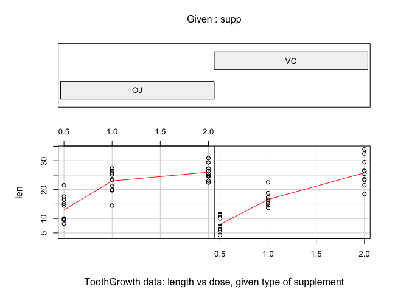

# STATISTICAL INFERENCE COURSE PROJECT: PART 2- ANALYZING TOOLGROWTH DATA
Lawrence Lau  

**<font color=blue> Overview </font>**<br>
This report provides basic data exploratory and statistical analysis of the ToothGrowth dataset.  The [dataset's infosheet](http://www.inside-r.org/r-doc/datasets/ToothGrowth) states ToothGrowth measures the length (len) of teeth in each of 30 guinea pigs after three dose (dose) levels of Vitaminc C (.5, 1, and 2 mg) with each of two delivery methods (supp), Orange Juice (OJ) and Ascorbic Acid (VC).

**<font color=blue> Loading and Exploring Data </font>**<br>
Loading and viewing the structure of the ToolGrowth dataset.

```r
data(ToothGrowth)
str(ToothGrowth)
```

```
## 'data.frame':	60 obs. of  3 variables:
##  $ len : num  4.2 11.5 7.3 5.8 6.4 10 11.2 11.2 5.2 7 ...
##  $ supp: Factor w/ 2 levels "OJ","VC": 2 2 2 2 2 2 2 2 2 2 ...
##  $ dose: num  0.5 0.5 0.5 0.5 0.5 0.5 0.5 0.5 0.5 0.5 ...
```
We see there are 60 observations (rows) of 3 variables (columns), 2 numeric (len and dose) and 1 factor(supp).


Viewing a summary of ToothGrowth.

```r
summary(ToothGrowth)
```

```
##       len       supp         dose     
##  Min.   : 4.2   OJ:30   Min.   :0.50  
##  1st Qu.:13.1   VC:30   1st Qu.:0.50  
##  Median :19.2           Median :1.00  
##  Mean   :18.8           Mean   :1.17  
##  3rd Qu.:25.3           3rd Qu.:2.00  
##  Max.   :33.9           Max.   :2.00
```


Viewing the first few lines of ToothGrowth.

```r
head(ToothGrowth)
```

```
##    len supp dose
## 1  4.2   VC  0.5
## 2 11.5   VC  0.5
## 3  7.3   VC  0.5
## 4  5.8   VC  0.5
## 5  6.4   VC  0.5
## 6 10.0   VC  0.5
```
The three variables are length of teeth (len), dose levels of Vitamin C (dose), and delivery method (supp).  

[Inside-R.Org](http://www.inside-r.org/r-doc/datasets/ToothGrowth) provides a good plot that allows us to visualize the data.  We replicate it here.

```r
require(graphics)
coplot(len ~ dose | supp, data = ToothGrowth, panel = panel.smooth, 
       xlab = "ToothGrowth data: length vs dose, given type of supplement")
```

 
<br>
The length of the teeth increases the higher the doses of given Vitamin C.  For doses of .5 and 1.0 mg it seems as if OJ is the more affective delivery method.  

**<font color=blue> Basic Summary of Data </font>**<br>

```r
library("lattice")
a <- aggregate(ToothGrowth$len, list(ToothGrowth$dose,ToothGrowth$supp),FUN=function(x) c(mean = mean(x), sd = sd(x)))
colnames(a)[c(1:3)] <- c("Dose", "Method", "Length")
a
```

```
##   Dose Method Length.mean Length.sd
## 1  0.5     OJ      13.230     4.460
## 2  1.0     OJ      22.700     3.911
## 3  2.0     OJ      26.060     2.655
## 4  0.5     VC       7.980     2.747
## 5  1.0     VC      16.770     2.515
## 6  2.0     VC      26.140     4.798
```
OJ's superior effectiveness in the .5 and 1.0 dosage amounts is evident.


