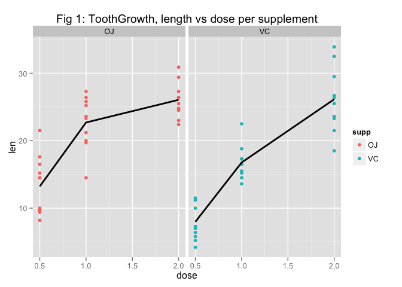

# STATISTICAL INFERENCE COURSE PROJECT: PART 2- ANALYZING TOOLGROWTH DATA
Lawrence Lau  

**<font color=blue> Overview </font>**<br>
This report provides basic data exploratory and statistical analysis of the [ToothGrowth dataset](http://www.inside-r.org/r-doc/datasets/ToothGrowth), which measures the length (len) of teeth in each of 30 guinea pigs after three dose (dose) levels of Vitaminc C (.5, 1, and 2 mg) with each of two delivery methods (supp), Orange Juice (OJ) and Ascorbic Acid (VC).

**<font color=blue> 1.) Loading and Exploring Data </font>**<br>
Loading and viewing a summary of the ToolGrowth dataset, then viewing the first few lines.

```r
data(ToothGrowth)
summary(ToothGrowth)
```

```
##       len       supp         dose     
##  Min.   : 4.2   OJ:30   Min.   :0.50  
##  1st Qu.:13.1   VC:30   1st Qu.:0.50  
##  Median :19.2           Median :1.00  
##  Mean   :18.8           Mean   :1.17  
##  3rd Qu.:25.3           3rd Qu.:2.00  
##  Max.   :33.9           Max.   :2.00
```

```r
head(ToothGrowth, n=2L)
```

```
##    len supp dose
## 1  4.2   VC  0.5
## 2 11.5   VC  0.5
```
The three variables are length of teeth (len), dose levels of Vitamin C (dose), and delivery method (supp).  

Let's visualize the data. (Reference Appendix for Fig 1)

```r
library(ggplot2)
g <- ggplot(ToothGrowth, aes(x = dose, y = len, color = supp)) + geom_point()
g <- g + stat_summary(aes(group = 1), geom = "line", fun.y = mean, size = 1, col = "black")
g <- g + facet_grid(. ~ supp) + ggtitle("Fig 1: ToothGrowth, length v dose per supplement")
g
```

**<font color=blue> 2.) Basic Summary of Data </font>**<br>

```r
library("lattice")
a <- aggregate(ToothGrowth$len, list(ToothGrowth$dose,ToothGrowth$supp),FUN=function(x) c(mean = mean(x), sd = sd(x)))
colnames(a)[c(1:3)] <- c("Dose", "Method", "Length")
a
```

```
##   Dose Method Length.mean Length.sd
## 1  0.5     OJ      13.230     4.460
## 2  1.0     OJ      22.700     3.911
## 3  2.0     OJ      26.060     2.655
## 4  0.5     VC       7.980     2.747
## 5  1.0     VC      16.770     2.515
## 6  2.0     VC      26.140     4.798
```
It appears as if OJ is more effective in the .5 and 1.0 dosage amounts.  But let's find out if that's really the case.  

**<font color=blue> 3.) Compare tooth growth by supp and dose using confidence intervals and hypothesis tests </font>**<br>

H0: Tooth growth is uneffected by supp type.  (OJ mean = VC mean)
Ha: Tooth growth is effected by supp type.  (OJ mean != VC mean)

```r
attach(ToothGrowth)
t.test(len ~ supp)
```

```
## 
## 	Welch Two Sample t-test
## 
## data:  len by supp
## t = 1.915, df = 55.31, p-value = 0.06063
## alternative hypothesis: true difference in means is not equal to 0
## 95 percent confidence interval:
##  -0.171  7.571
## sample estimates:
## mean in group OJ mean in group VC 
##            20.66            16.96
```
The result's inconclusive, since the 95% confidence interval includes 0. The p-value is > .05 so we can't reject H0.  However...


```r
t.test(len ~ supp, conf.level=.90)$conf
```

```
## [1] 0.4683 6.9317
## attr(,"conf.level")
## [1] 0.9
```
...with a 90% confidence interval we do see that OJ is more effective than VC.  

Let's see if different dosages had an effect on length.  First, .5 vs 1.0. 

```r
Dose.5v1 <- subset(ToothGrowth, dose %in% c(0.5, 1.0))
t.test(len ~ dose, paired = FALSE, var.equal=FALSE, data=Dose.5v1)$conf
```

```
## [1] -11.984  -6.276
## attr(,"conf.level")
## [1] 0.95
```
We see a dosage of 1.0 absolutely results in a higher mean length than 0.5.  

Next, 1.0 vs 2.0.

```r
Dose1v2 <- subset(ToothGrowth, dose %in% c(1.0, 2.0))
t.test(len ~ dose, paired = FALSE, var.equal=FALSE, data=Dose1v2)$conf
```

```
## [1] -8.996 -3.734
## attr(,"conf.level")
## [1] 0.95
```
Here, a dosage of 2.0 absolutely results in a higher mean length than 1.0. 

**<font color=blue> 4.) Conclusions and Assumptions</font>**<br>

* We have a 90% confidence interval that Orange Juice is a more effective mode of supplement for Vitamin C than Ascorbic Acid. Extrapolated to a 95% confidence interval though and the results are inconclusive. In any case, we cannot reject the null hypothesis based on a hypothesis test.

* The higher the dose of Vitamin C, the longer the resulting length of tooth.  

* These conclusions assume a constant but different variance in all groups.  It is also assumed the data are not paired, since no two teeth, even in the same mouth, grow to the same exact length.   

<p>
**<font color=blue> Appendix - Fig 1</font>**<br>
 
